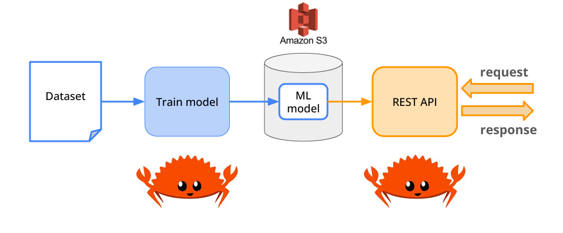

# 🏠 House Price Prediction - ML in Rust

A high-performance house price prediction system implemented in Rust, leveraging Rust's safety guarantees and blazing-fast performance for machine learning applications.

## 🚀 Features

- **Pure Rust Implementation**: Built entirely in Rust for maximum performance and safety
- **Fast Data Processing**: Using Polars for lightning-fast DataFrame operations
- **Production-Ready ML**: Complete ML pipeline from data ingestion to API serving
- **AWS Integration**: Model storage and versioning in S3
- **RESTful API**: High-performance prediction serving

## 🛠 Tech Stack

- **Language**: Rust 🦀
- **ML Processing**: Polars for DataFrame operations
- **Model Storage**: AWS S3
- **API Framework**: Rust web framework
- **Development Tools**: 
  - cargo
  - rustc
  - rust-analyzer
  - VSCode/Cursor

## 🏗 Architecture



## 🚀 Getting Started

### Prerequisites

```bash
# Install Rust
curl --proto '=https' --tlsv1.2 -sSf https://sh.rustup.rs | sh

# Install development tools
rustup component add rustfmt
rustup component add clippy
```

### Installation

```bash
# Clone the repository
git clone https://github.com/owoeye-babatunde/homesmart.git

# Build the project
cargo build --release

# Run the tests
cargo test
```

## 📊 Machine Learning Pipeline

1. **Data Loading**
   - Efficient CSV parsing in Rust
   - Memory-safe data handling
   - Type-safe data structures

2. **Feature Engineering**
   - Fast DataFrame operations with Polars
   - Custom feature transformations
   - Memory-efficient processing

3. **Model Training**
   - Implementation of ML algorithms in Rust
   - Cross-validation and metrics
   - Model serialization

4. **Model Deployment**
   - AWS S3 integration for model storage
   - Version control for models
   - Efficient model loading

5. **API Serving**
   - Fast REST API implementation
   - Concurrent request handling
   - Low-latency predictions

## 🔧 Development

```bash
# Format code
cargo fmt

# Run linter
cargo clippy

# Run development server
cargo run --bin api
```

## 🎯 Performance Highlights

- Zero-cost abstractions for ML operations
- Memory-safe data processing
- Thread-safe concurrent predictions
- Compile-time error checking

## 🧪 Testing

```bash
# Run unit tests
cargo test

# Run integration tests
cargo test --test '*'
```

## 📈 Benchmarks

```bash
# Run benchmarks
cargo bench
```

## 🤝 Contributing

1. Fork the repo
2. Create a feature branch
3. Commit changes
4. Push to branch
5. Create Pull Request

## 🔑 Key Benefits of Rust Implementation

- **Safety**: Memory safety without garbage collection
- **Performance**: Zero-cost abstractions and minimal runtime
- **Concurrency**: Fearless concurrency with ownership model
- **Tooling**: Excellent tooling with cargo and rust-analyzer
- **Error Handling**: Robust error handling with Result type

## 📝 Future Improvements

- [ ] Implement additional ML algorithms
- [ ] Add real-time prediction capabilities
- [ ] Enhance feature engineering pipeline
- [ ] Improve model versioning system
- [ ] Add monitoring and metrics

## 📄 License

This project is licensed under the MIT License - see the [LICENSE](LICENSE) file for details.

## 🙏 Acknowledgments

- Rust ML community
- Polars team
- AWS SDK for Rust contributors
